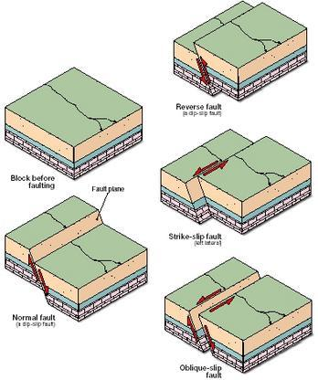
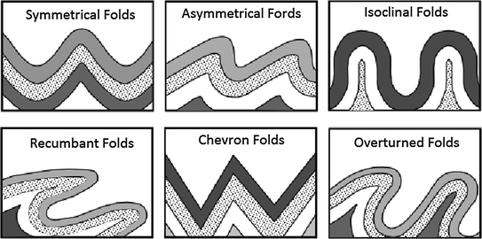

### INTRODUCTION 

Geographical profiles of a contour map gives a "side view" of the landscape along a section on the map. It gives a visual representation of data. Maps are two-dimensional but contour maps represent three dimensional areas in two dimensional map.

The movement of tectonic plates due to convection inside the Earth’s cause the plates to collide or move away causing compressive or tension stress on the surface. When the stress developed become greater than the strength of the rock, the rock breaks and a fault forms. The sudden rupturing causes an earthquake, whereas, the small fault segments links up gradually and forms a larger fault plane. During deformation of rocks, if it bends instead of breaking it give rise to formation of folds. The length of faults range from a few centimeters to many hundreds of kilometers, and displacement may range from less than a centimeter to several hundred kilometers along the fracture surface. In some cases, the movement is distributed over a fault zone composed of many individual faults that occupy a belt hundreds of meters wide.

Faults may be horizontal, vertical, or inclined at any angle. When rocks slip past each other in faulting, the upper or overlying block along the fault plane is called the hanging wall, or headwall, the block below is called the footwall.

Based on direction of slip, faults can be categorized as:

<strong>Strike-slip fault</strong>

In a strike-slip fault the fault surface is usually near vertical and the footwall moves laterally either left or right with very little vertical motion. Strike-slip faults with left-lateral motion are also known as sinistral faults.

<strong>Dip-slip faults</strong>

Dip-slip faults can be either normal or reverse. In a normal fault, the hanging wall moves downward, relative to the footwall. A downthrown block between two normal faults dipping towards each other is a graben. An upthrown block between two normal faults dipping away from each other is a horst. Low-angle normal faults with regional tectonic significance may be designated detachment faults.

<strong>Oblique-slip fault</strong>
  

A fault which has a component of dip-slip and a component of strike-slip is termed an oblique-slip fault. Nearly all faults have some component of both dip-slip and strike-slip, so defining a fault as oblique requires both dip and strike components to be measurable and significant.

  

 Types of Faults
 

Source: (<a href="https://mountainbuildingproject.weebly.com/diagram2.html">https://mountainbuildingproject.weebly.com/diagram2.html</a>)

 

If the rock bends instead of breaking it give rise to formation of folds. The tectonic folding may arise mainly due to tangential compression. The primary force acts at right angles to the trend of folds under the influence of the tangential stresses developing folds in three ways namely flexural folding, flowage folding and shear folding. Flexural folding occurs when competent or stronger rocks are thrown into folds due to their sliding against each other under the influence of lateral compression. Flowage folding occurs in incompetent or weaker plastic type of rocks such as clays, shales, gypsum and rock salt etc. folding is attributed to shearing stresses rather than simple compression. Shear folding is attributed to shearing stresses rather than simple compression.

The folds can also be classified into many types based on many other factors. Some of them are,

<ul style="text-indent:25px;text-align:justify;list-style-position:inside">
<li><strong>Anticline</strong>: It consist the oldest rock materials in the core and youngest material in the top of the fold, also called as ridge type fold.</li>
<li><strong>Syncline</strong>: It consist the youngest rock materials in the core and older material in the top of the fold, also called as sinking type fold.</li>
<li><strong>Monocline</strong>: Fold in knee that only has one flank.</li>
<li><strong>Symmetrical</strong>: Occurs when the angle between the two flanks with the horizontal is approximately the same.</li>
<li><strong>Asymmetrical</strong>: Occurs when the two sides of rocks have distinctly different inclinations.</li>
<li><strong>Inclined</strong>: Occurs when the axial plane forms an angle with the vertical.</li>
<li><strong>Recumbent</strong>: Occurs when the axial plane is almost horizontal.</li>
<li><strong>Isoclinal</strong>: Occurs when the thickness of each layer does not vary along the fold. Origin to bending stresses attributed type.</li>
<li><strong>Antiform</strong>: It is a linear type of folds. The strata dip is not close to the axial center and there is no information of its age.</li>
<li><strong>Synoform</strong>: It is a linear type of folds with the strip data moving in the axial center direction.</li>
<li><strong>Dome</strong>: It is a nonlinear type of fold moving the strata dip from the center in every direction consisting oldest strata in the center.</li>
<li><strong>Basin</strong>: It is a nonlinear with strata dip moving toward the center in all the directions consisting youngest strata in the center.</li>
<li><strong>Chevron</strong>: It is a linear type of fold oriented toward the long angle.</li>
</ul>

  

Types of Folds
 

Source: (Dingxiang Zou, Theory and Technology of Rock Excavation for Civil Engineers, 2015)

