### These procedure steps will be followed on the simulator

1. When you click on a Contour Map file, a new window will open, Click on the Next button at the bottom right corner to move to the next step. 
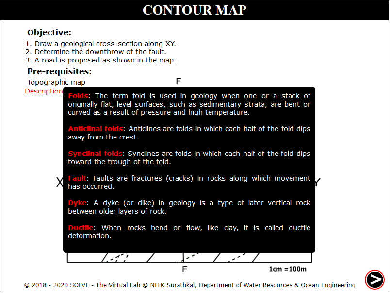 

2. Click on rectangular box to select the section where profile is created. Click Next. 
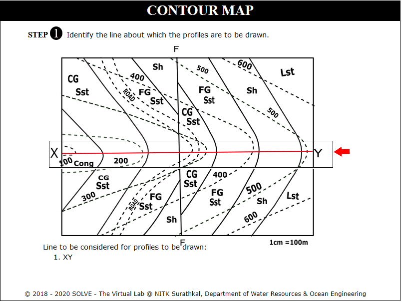 

3. Click on Get paper and Mark Points to mark dotted lines intersecting the XY profile. Click Next. 
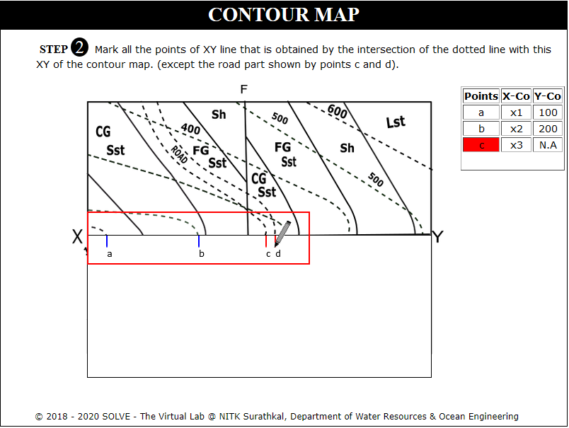 

4. Click on Plot X Axis, Plot Y Axis, Points on X Axis, Points on Y Axis to plot axis of the graph. Click Next. 
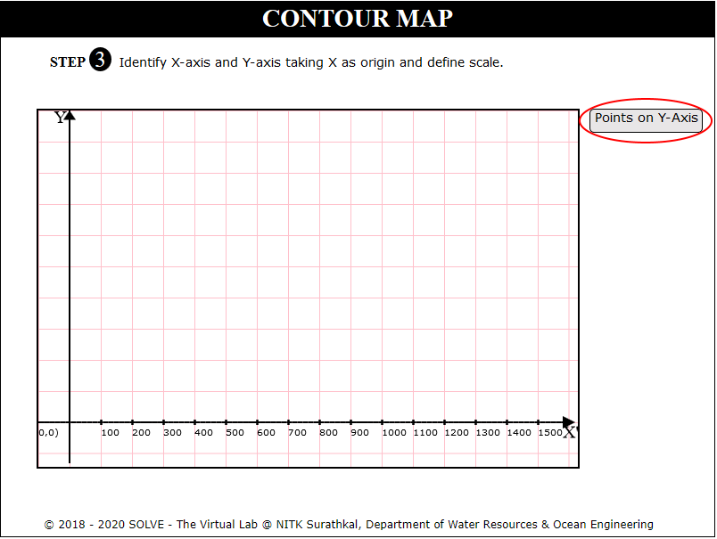 

5. Click on Define Coordinates and click on each point to plot on the graph. 
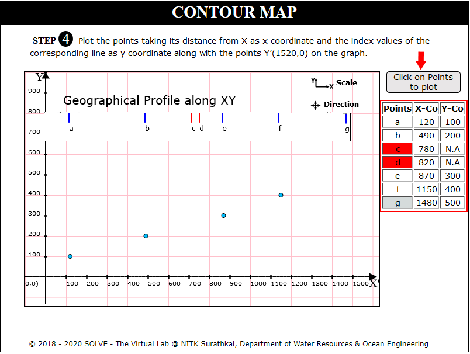 

6. Click on Plot Y' X:1520 Y:0 to draw perpendicular line at Y=1520.Click Next. 
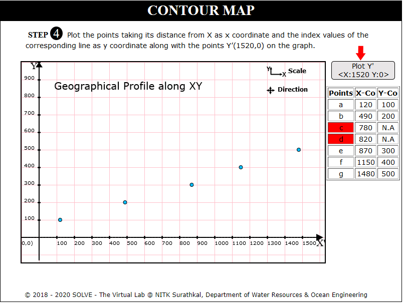 

7. Click on Get paper and Mark Points to mark solid lines intersecting the profile.Click Next. 
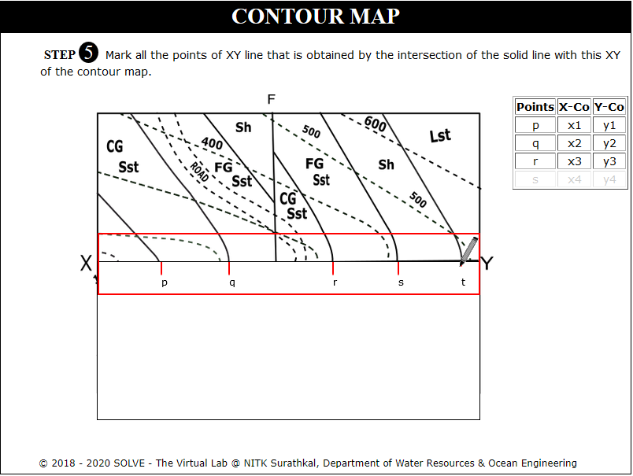 

8. Click on Define X Coordinates and name the points p,q,r taking its distance from X as x Coordinate. 
 

9. Read the instructions to calculate the index of solid lines and click Next. 
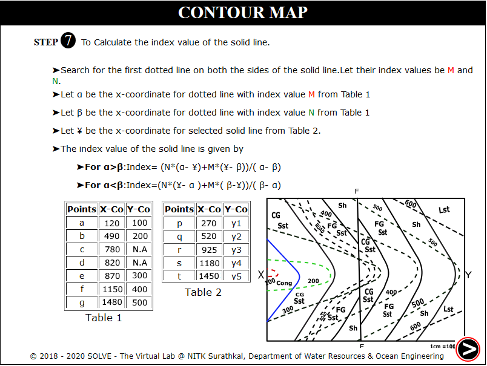 

10. Calculate index of each solid line by selecting appropriate M and N value and Click Next. 
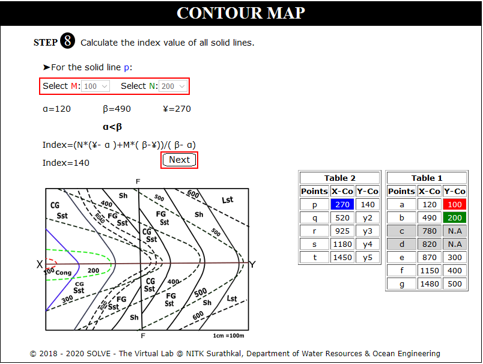 

11. Click on each point to plot points p to u. Click Next. 
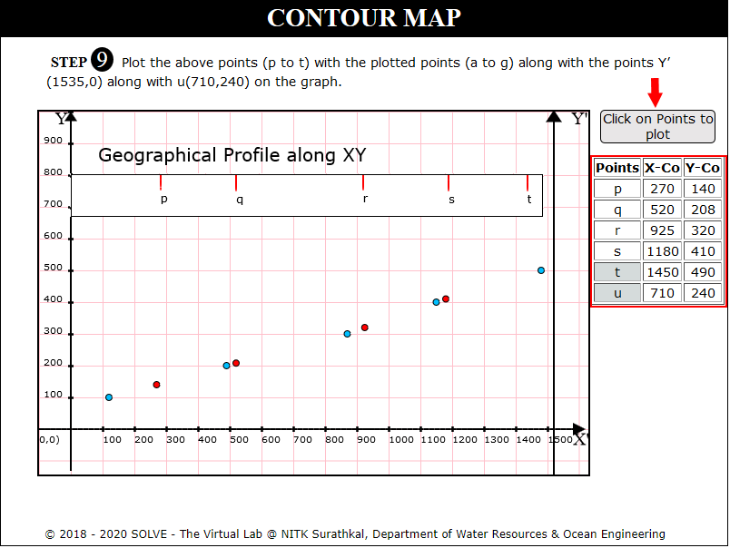 

12. Click on join points and Name points to plot points on the graph. Click Next. 
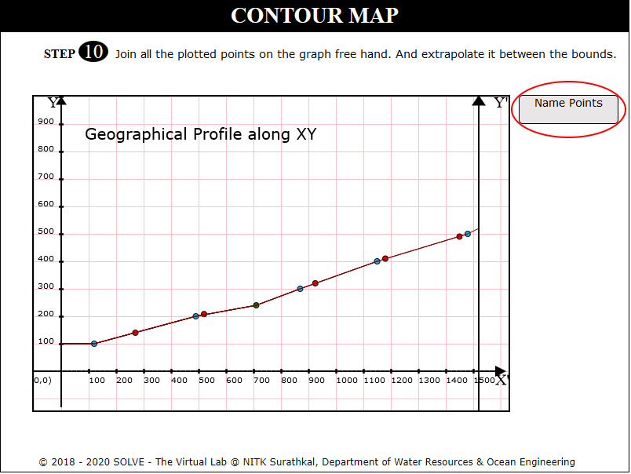 

13. Click on Plot points C and D to mark road points on the cross section. Click Next. 
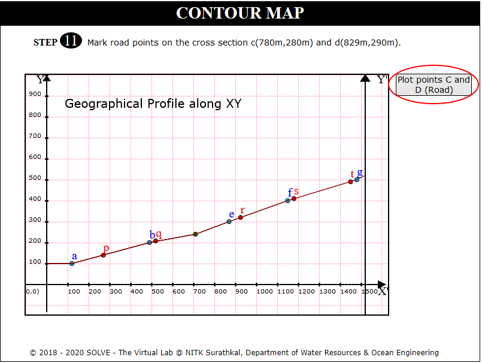 

14. Click on Draw Fault Lines. Click Next. 
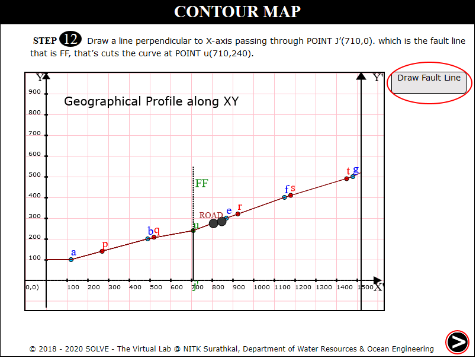 

15. View the formula to calculate angle of dip at point where the dotted lines intersect the solid lines. Click Next. 
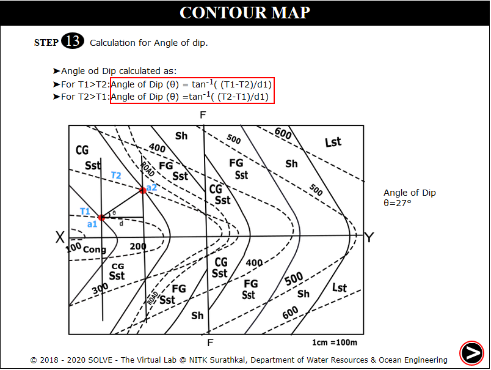 

16. Draw lines at angle of dip from point p to u intersecting the X axis Click Next. 
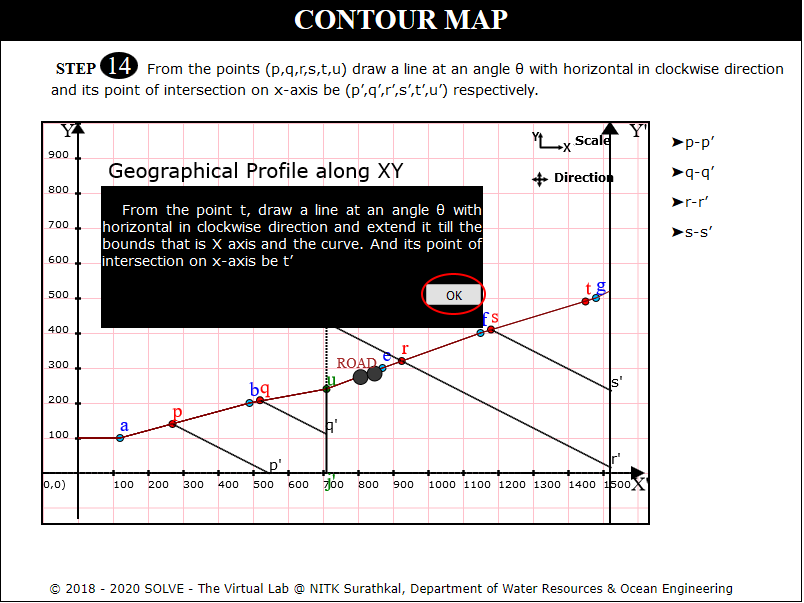 

17. Click on each stone type to see the distribution, click Next. 
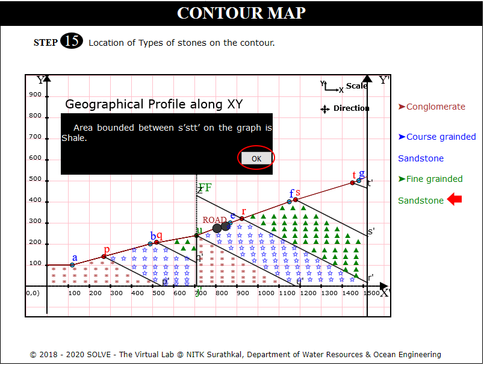 

18. Click on Ok to determine downthrow of fault. 
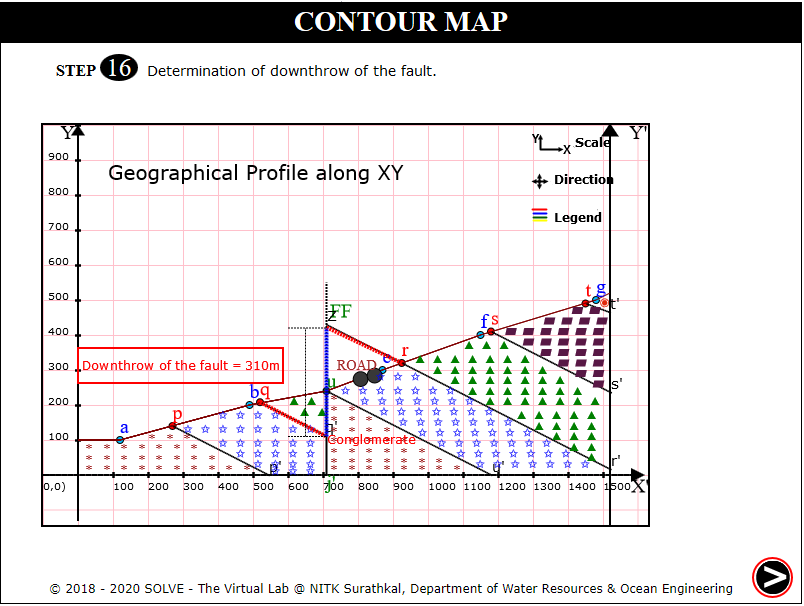 

19. Click on each label button to see the different graph. 
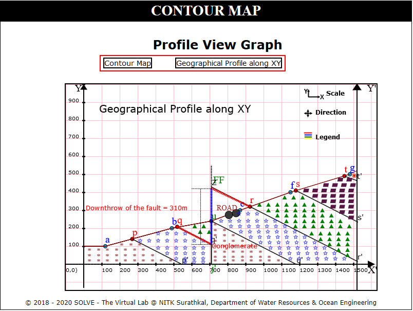 
